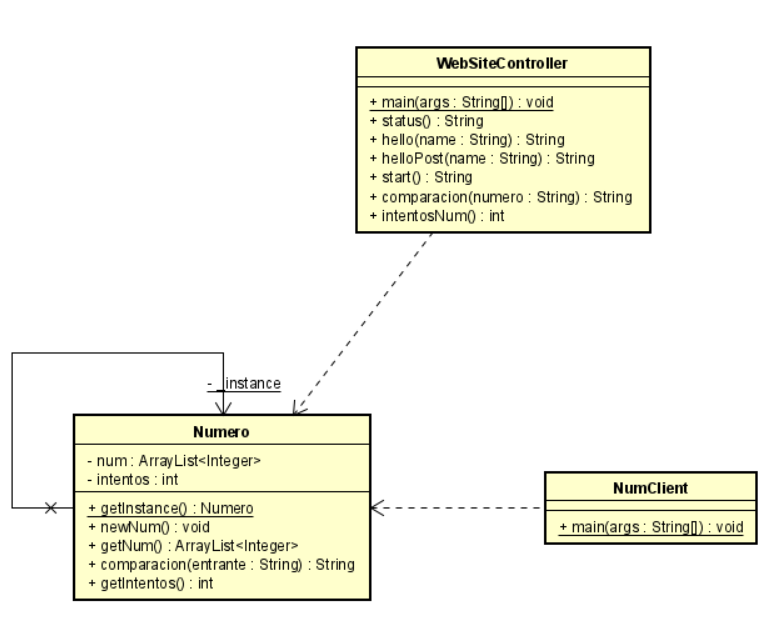

# Titulo

Heroku Spring

## Descripción

En este repositorio se encontrará un programa que recrea los primeros pasos de spring en heroku y un juego de famas y picas.

Para ver la implementación en Heroku dirijase [aquí](https://fierce-ravine-41226.herokuapp.com/)

### LOC/h

Para este taller se hicieron 317 líneas de código, en 5 horas.

**63.4 LOC/h**

### Prerrequisitos

Para correr este se debe tener instalado:

- Maven
- Java

### Guía de uso

Para compilar el proyecto se debe usar:

```
mvn package
```

Para ejecutarlo, se debe hacer de la siguiente forma

```
$ java -jar target/spring-1.0.jar
```

Una vez ejecute este comando podrá ingresar al servidor web desde su navegador con la siguiente ruta http://localhost:5000, en esta encontrará una página HTML con 4 enlaces que lo redireccionaran

Si desea visualizar cualquiera de estos por separado debe indicar la ruta completa donde se encuentran, el primer enlace lleva a un método get que da un hello world, un segundo que muestra el status del servidor, otro que, con formularios, se puede modificar una salida dado un método post y un método get, y por último un enlace al juego de picas y famas.

En caso de querer probar el juego por consola para ver su correcto funcionamiento, ejecute el siguiente codigo:

```
$ java -cp "target\classes" co.edu.escuelaing.app.entities.NumClient
```

Este ejecutará una consola en la cual puede probar el funcionamiento del juego viendo el número que se asignó de forma randomizada.

## Documentación

Para visualizar la documentación se debe ejecutar el siguiente comando:

```
mvn javadoc:javadoc
```

Una vez se realice este comando, se debe buscar en la siguiente ruta "target\site\apidocs\index.html"

## Estructura de Archivos

    .
    |____pom.xml
    |____src
    | |____main
    | | |____java
    | | | |____co
    | | | | |____edu
    | | | | | |____escuelaing
    | | | | | | |____app
    | | | | | | | |____entities
    | | | | | | | | |____NumClient.java
    | | | | | | | | |____Numero.java
    | | | | | | | |____handlers
    | | | | | | | | |____WebSiteController.java
    | |____resources
    | | |____static
    | | | |____js
    | | | | |____juego.js
    | | | |____style
    | | | | |____juego.css
    | | | |____formulario.html
    | | | |____index.html
    | | | |____juego.html
    | |____test
    | | |____java
    | | | |____co
    | | | | |____edu
    | | | | | |____escuelaing
    | | | | | | |____app

## Diagrama de Clases



## Construido con

- [Maven](https://maven.apache.org/) - Dependency Management
- [Java](https://www.java.com/es/) - Progamming Language

## Autor

- **Juan Carlos Baez Lizarazo** - [juanbaezl](https://github.com/juanbaezl)

## Fecha

21 de Junio, 2022

## Licencia

Para más información ver: [LICENSE.txt](License.txt)
